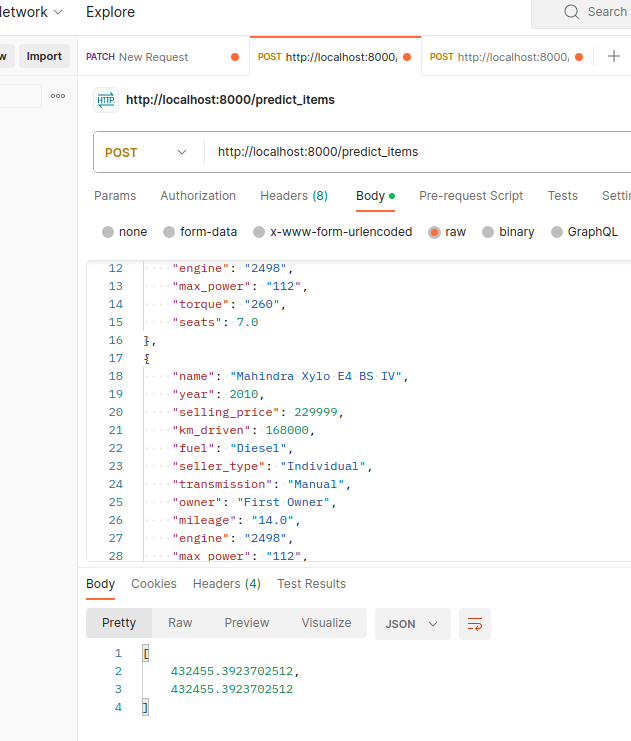

## что было сделано и с какими результатами
* Была проведена EDA над данными:
    * удалены данные с одинаковыми признаковомы описанием;
    * обработали столбцы: mileage, engine, max_power и torque;
    * заполнили пропуски медианнымии значениями;
    * визуализилировали данные и установили корреляции.

* Построенам модель только на вещественных признаках

    * Обучили классическую линейную регрессию, стандартизацуем фичи      
    * Обучили Lasso-регрессию      
    * Обучили ElasticNet-регрессию      

* Добавляем категориальные фичи

    * Закодировали категориальные фичи методом OneHot-кодирования
    * Подобрали параметр регуляризации alpha для гребневой регрессии:
* Посчитали кастомную метрику
* Реализовали сервис FastAPI

### что сделать не вышло и почему (это нормально, даже хорошо😀)
* не хватило времени "поиграться" с дополнительными парметрами и более внимательно поработать с сервисом.

### Пруфы
